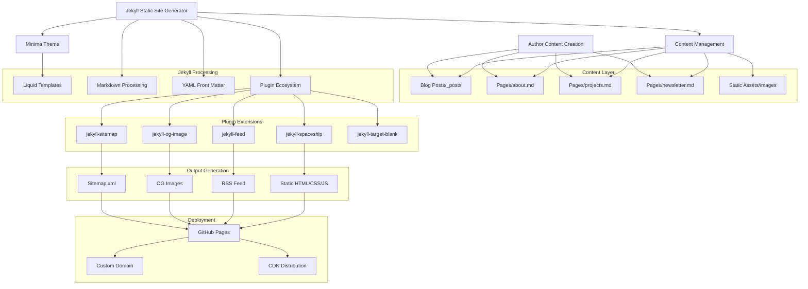
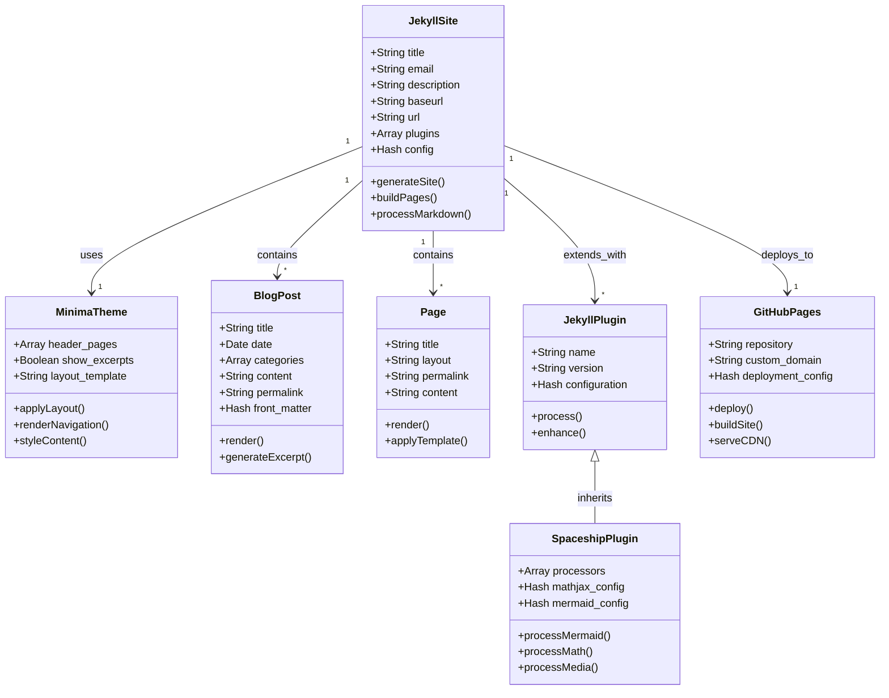
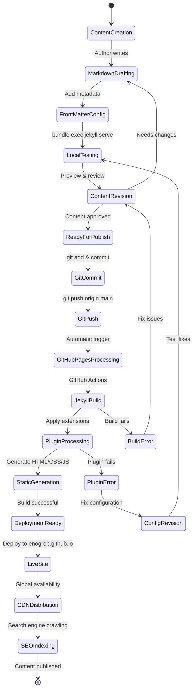
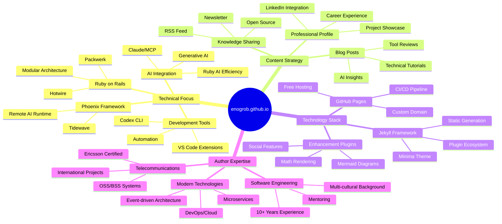
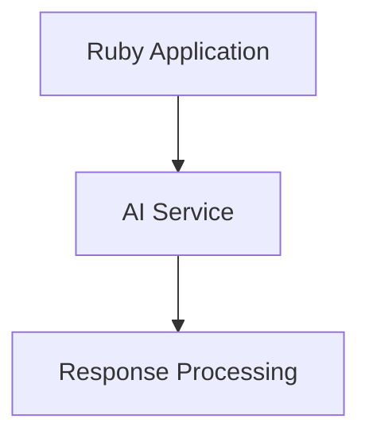

# **Project Blog Enogrob**

[Homepage](https://enogrob.github.io)


## Contents

- [Summary](#summary)
- [Architecture](#architecture)
  - [Alternative Perspectives](#alternative-perspectives)
  - [Key Concepts](#key-concepts)
- [Tech Stack](#tech-stack)
- [Getting Started](#getting-started)
- [Usage Examples](#usage-examples)
- [Contributing Guidelines](#contributing-guidelines)
- [License](#license)
- [References](#references)

## Summary

**enogrob.github.io** is a personal technical blog authored by Roberto Nogueira, a seasoned Software/Telecommunications Engineer with over 10 years of experience. The blog serves as a platform for sharing insights on modern software development, with a particular focus on Ruby on Rails, AI integration, and emerging technologies. Built using Jekyll static site generator and hosted on GitHub Pages, the blog demonstrates best practices in static site deployment and content management.

The blog features a rich collection of technical articles covering topics such as generative AI, Ruby on Rails development, Phoenix framework, VS Code customization, and innovative tools like MCP (Model Context Protocol) servers. Roberto's writing style combines practical tutorials with thoughtful analysis of technology trends, making complex concepts accessible to developers of varying experience levels. The content reflects his extensive background in Ruby on Rails (7+ years), Elixir, JavaScript, React, GraphQL, and his experience as an Ericsson Certified Consultant.

What makes this blog particularly valuable is its focus on cutting-edge AI integration in traditional web development workflows, showcasing how established frameworks like Rails and Phoenix can leverage modern AI capabilities. The blog serves software engineers, Ruby developers, and technology enthusiasts interested in staying current with AI-powered development tools and methodologies.

## Architecture



### Alternative Perspectives

<details>
<summary><strong>1. Class Diagram - Structural Relationships</strong> (Click to expand)</summary>



</details>

<details>
<summary><strong>2. Journey Process - State Transitions</strong> (Click to expand)</summary>



</details>

<details>
<summary><strong>3. Mind Map - Interconnected Themes</strong> (Click to expand)</summary>



</details>

### Key Concepts

* **Jekyll Static Site Generator**: A Ruby-based tool that transforms plain text files (Markdown, HTML, CSS) into static websites, eliminating the need for databases or server-side processing while maintaining blog-aware features like posts, categories, and permalinks.

* **Minima Theme**: Jekyll's default theme providing a clean, responsive design optimized for technical blogs, featuring built-in navigation, post layouts, and social media integration with minimal configuration required.

* **GitHub Pages Integration**: Free static site hosting service that automatically builds and deploys Jekyll sites from GitHub repositories, providing custom domain support and global CDN distribution without additional hosting costs.

* **Jekyll Spaceship Plugin**: An advanced plugin that extends Jekyll's Markdown processing capabilities to support Mermaid diagrams, mathematical expressions, PlantUML diagrams, media embeds, and enhanced table formatting for technical documentation.

* **Front Matter Configuration**: YAML-based metadata headers in Jekyll files that control page behavior, including layout selection, categorization, URL permalinks, and custom variables accessible throughout the site's templates.

* **Liquid Template Engine**: Jekyll's templating language that enables dynamic content generation, variable interpolation, conditional logic, and loops within static site templates for flexible content presentation.

* **RSS Feed Generation**: Automated creation of syndicated content feeds allowing readers to subscribe to blog updates through feed readers, implemented via the jekyll-feed plugin with customizable content formatting.

* **Open Graph Image Generation**: Automatic creation of social media preview images for blog posts using the jekyll-og-image plugin, ensuring consistent branding and improved social sharing engagement.

## Tech Stack

* **Programming Language**: Ruby (Jekyll framework foundation) with Liquid templating for dynamic content generation
* **Framework**: Jekyll 4.3.4 - Static site generator optimized for blogs and documentation sites
* **Theme**: Minima 2.5 - Responsive Jekyll theme with clean typography and mobile-first design
* **Libraries/Dependencies**: 
  - jekyll-spaceship: Advanced Markdown processing with Mermaid, LaTeX, and media support
  - jekyll-feed: RSS/Atom feed generation for content syndication
  - jekyll-og-image: Social media preview image generation
  - jekyll-sitemap: XML sitemap generation for SEO optimization
  - jekyll-target-blank: Automatic external link handling for security
  - jekyll-redirect-from: URL redirection management for content migration
* **Build Tools**: Bundler for Ruby gem dependency management and version control
* **Deployment**: GitHub Pages with automatic Jekyll building and GitHub Actions CI/CD pipeline
* **Version Control**: Git with GitHub hosting for source code management and collaborative development
* **Content Management**: Markdown with YAML front matter for structured content authoring
* **Development Tools**: 
  - Bundle exec for consistent Ruby environment execution
  - Jekyll serve for local development server with live reload
  - Ruby LSP for enhanced development experience
* **Enhancement Features**:
  - Mermaid diagram rendering for technical documentation
  - MathJax integration for mathematical expression display
  - PlantUML support for UML diagram generation
  - Emoji processing for enhanced content expression
* **Performance Optimization**: Static site generation for fast loading times and CDN-friendly distribution
* **SEO Tools**: Built-in sitemap generation, meta tag optimization, and social media integration

## Getting Started

To set up and run the enogrob.github.io blog locally, follow these steps based on the project's Jekyll configuration:

1. **Prerequisites**: Ensure you have Ruby 2.7+ and Bundler installed on your system
   ```bash
   ruby --version
   gem install bundler
   ```

2. **Clone the Repository**:
   ```bash
   git clone https://github.com/enogrob/enogrob.github.io.git
   cd enogrob.github.io
   ```

3. **Install Dependencies**:
   ```bash
   bundle install
   ```

4. **Local Development Server**:
   ```bash
   bundle exec jekyll serve
   ```
   The site will be available at `http://localhost:4000` with live reload enabled for development.

5. **Build for Production**:
   ```bash
   bundle exec jekyll build
   ```
   Generated files will be placed in the `_site` directory.

6. **Environment Configuration**: 
   - The site uses Ruby version management via `.tool-versions` file
   - Jekyll configuration is defined in `_config.yml` with custom plugin settings
   - Local development includes draft posts and future-dated content

7. **Content Creation**:
   - Blog posts go in `_posts/` directory with naming convention: `YYYY-MM-DD-title.md`
   - Pages can be created as Markdown files in the root directory
   - Use YAML front matter for metadata and layout configuration

8. **Plugin Features**: The site includes advanced features like Mermaid diagrams, mathematical expressions, and enhanced media embedding that work automatically in Markdown content.

## Usage Examples

Based on the project's structure and content, here are practical examples of using the enogrob.github.io blog:

**Creating a New Blog Post**:
```markdown
---
layout: post
title: "Your Technical Article Title"
date: 2025-07-06 20:00:00 -0300
categories: ruby rails ai
mermaid: true
---

Your content here with support for:
- Mermaid diagrams
- Mathematical expressions
- Enhanced Markdown features
```

**Adding Mermaid Diagrams** (as used in the AI architecture posts):
```markdown

```

**Including Mathematical Expressions** (via jekyll-spaceship plugin):
```markdown
The efficiency formula: $E = \frac{output}{input} \times 100\%$

Or for display math:
$$\sum_{i=1}^{n} x_i = x_1 + x_2 + \cdots + x_n$$
```

**Creating Project Links** (as shown in projects.md):
```markdown
<a href="https://github.com/enogrob/project-name" target="_blank" rel="noopener">
  project-name
</a>
```

**Customizing Page Layout** (as used in about.md):
```markdown
---
layout: page
title: About
permalink: /about/
---


Your professional bio and contact information.
```

**Adding Categories and Tags** for content organization:
```markdown
---
categories: ruby rails ai development
tags: [tutorial, beginner, web-development]
---
```

**Using Redirects** for URL management:
```markdown
---
redirect_from: 
  - /old-url/
  - /another-old-url/
---
```

These examples demonstrate the blog's capabilities for technical content creation, visual documentation, and professional presentation as implemented in Roberto's actual blog posts.

## Contributing Guidelines

The enogrob.github.io blog follows standard Jekyll and GitHub Pages development practices. While this is primarily a personal blog, the open-source nature allows for community contributions:

**Development Workflow**:
- Fork the repository from [enogrob/enogrob.github.io](https://github.com/enogrob/enogrob.github.io)
- Create feature branches for any proposed changes or corrections
- Follow the existing Markdown formatting and YAML front matter conventions
- Test changes locally using `bundle exec jekyll serve` before submitting
- Submit pull requests with clear descriptions of modifications

**Content Standards**:
- Maintain the technical focus on software development, AI integration, and modern web technologies
- Use proper Markdown syntax and leverage jekyll-spaceship features for enhanced content
- Include appropriate categories and tags for content organization
- Follow the established date format (YYYY-MM-DD) for blog post naming
- Ensure all external links use `target="_blank" rel="noopener"` for security

**Code Quality**:
- Validate HTML/CSS output during local testing
- Ensure responsive design compatibility across devices
- Maintain compatibility with GitHub Pages Jekyll version constraints
- Test plugin functionality (Mermaid diagrams, mathematical expressions) before deployment

**Issue Reporting**:
- Use GitHub Issues for reporting bugs, broken links, or content suggestions
- Provide specific details about browser compatibility issues or rendering problems
- Include steps to reproduce any technical issues encountered

**Blog Enhancement**:
- Suggest new Jekyll plugins that enhance technical documentation capabilities
- Propose improvements to site navigation, SEO optimization, or performance
- Contribute corrections to technical accuracy or outdated information in posts

The blog maintains high standards for technical accuracy and professional presentation, reflecting Roberto's expertise in software engineering and telecommunications.

## License

The enogrob.github.io blog project is hosted as an open-source repository on GitHub, following standard Jekyll and GitHub Pages licensing practices. The project uses:

**Jekyll Framework**: Released under the MIT License, allowing for free use, modification, and distribution of the static site generator and its associated themes and plugins.

**Minima Theme**: Licensed under the MIT License, providing unrestricted use of the theme's design and layout components.

**Content License**: Blog posts and original content are authored by Roberto Nogueira (enogrob) and reflect his professional insights and technical expertise. While the site structure is open source, the written content represents the author's intellectual property and professional work.

**Third-Party Dependencies**: All Jekyll plugins (jekyll-spaceship, jekyll-feed, jekyll-og-image, etc.) maintain their respective open-source licenses, typically MIT License, ensuring compatibility with the overall project structure.

**GitHub Pages Hosting**: Provided free of charge by GitHub with standard terms of service for static site hosting and automated deployment through GitHub Actions.

The open-source nature of the project allows for community contributions, educational use, and adaptation of the technical implementation while respecting the authored content and professional presentation standards established by the blog owner.

## References

* [enogrob.github.io - Official Blog Homepage](https://enogrob.github.io) - Roberto Nogueira's technical blog featuring AI integration, Ruby on Rails development, and modern software engineering insights
* [GitHub Repository - enogrob/enogrob.github.io](https://github.com/enogrob/enogrob.github.io) - Complete source code, configuration files, and development history of the Jekyll-based blog
* [Jekyll Official Documentation](https://jekyllrb.com/docs/) - Comprehensive guide to Jekyll static site generator features, configuration options, and best practices for blog development
* [Minima Theme Repository](https://github.com/jekyll/minima) - Official documentation and customization options for Jekyll's default Minima theme used in the blog
* [jekyll-spaceship Plugin](https://github.com/jeffreytse/jekyll-spaceship) - Advanced Markdown processing plugin enabling Mermaid diagrams, mathematical expressions, and enhanced media embedding
* [GitHub Pages Documentation](https://docs.github.com/en/pages) - Official guide to free Jekyll hosting, custom domain configuration, and automated deployment workflows
* [Roberto's LinkedIn Profile](https://linkedin.com/in/enogrob) - Professional background and experience details for the blog author, showcasing 10+ years in software/telecommunications engineering
* [Roberto's GitHub Profile](https://github.com/enogrob) - Collection of open-source projects including automation tools, MCP servers, and development utilities referenced in blog posts
* [Jekyll Feed Plugin](https://github.com/jekyll/jekyll-feed) - RSS/Atom feed generation for blog content syndication and reader subscription capabilities
* [Jekyll SEO Tag](https://github.com/jekyll/jekyll-seo-tag) - Search engine optimization and social media meta tag generation for improved content discoverability
* [Liquid Template Language](https://shopify.github.io/liquid/) - Documentation for Jekyll's templating engine used for dynamic content generation and site customization
* [Markdown Guide](https://www.markdownguide.org/) - Comprehensive reference for Markdown syntax used in blog post creation and content formatting
* [Mermaid Diagram Documentation](https://mermaid-js.github.io/mermaid/) - Official guide to creating flowcharts, sequence diagrams, and other technical visualizations used throughout the blog
* [Ruby Programming Language](https://www.ruby-lang.org/) - Official documentation for Ruby, the foundation language of Jekyll and focus of many blog articles
* [GitHub Actions for Pages](https://github.com/actions/deploy-pages) - Automated deployment workflows enabling continuous integration and delivery for the blog's publishing pipeline

